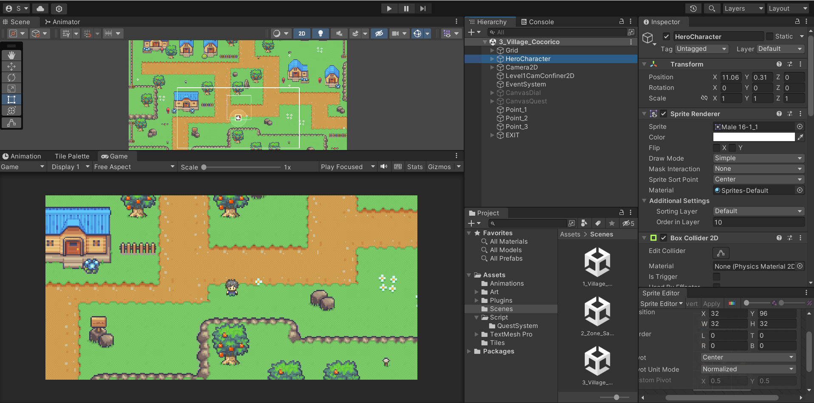

# RPG 2D en Pixel Art avec Unity

Bienvenue dans le projet **RPG2DCSharp** ! Ce projet a pour objectif d'apprendre à développer un RPG 2D avec Unity.



---

## Objectifs de ce projet
- Apprendre à créer un monde 2D avec un **Tileset**.
- Animer des personnages 2D (Sprites).
- Ajouter des PNJ (Personnages Non Joueurs) interactifs.
- Développer un **système de quête** personnalisé.
- Créer un **système de combat** (contre des ennemis).
- Intégrer un système d'expérience et de progression du personnage.
- Implémenter une **boutique** pour utiliser l'or gagné.
- Ajouter un système d'amélioration des caractéristiques du héros.
- Programmer un système de **sauvegarde** et de chargement des parties.
- Coder un système de **loot** (objets laissés par les ennemis).
- Écrire des dialogues dynamiques pour enrichir le gameplay.
- Apprendre les bases du **langage C#**.
- Compiler et partager votre jeu.

---

## Scénario et Gameplay

Notre jeu sera un **RPG 2D en vue de dessus classique**, où l'aventure commence dans un village paisible. Le héros, en quête de reconnaissance, devra réaliser diverses missions pour prouver sa valeur et obtenir la permission de quitter le village. 

### Points Clés du Jeu :
- **Exploration** : En dehors du village, des zones hostiles regorgent de monstres prêts à être combattus.
- **Progression** : Le héros pourra gagner de l'expérience, de l'or, et améliorer ses compétences.
- **Interactions** : Des dialogues avec les PNJ et des systèmes de quêtes permettront d'approfondir l'histoire.
- **Commerce et Stratégie** : Utilisez l'or dans une boutique pour acheter équipements et améliorations.
- **Extensions** : À mesure de l'aventure, de nouvelles zones et villages seront débloqués.

---

## Fonctionnalités à développer

1. **Création du monde**
   - Conception d'un monde en 2D à l'aide de Tilesets.
   - Gestion des collisions et navigation des personnages.

2. **Animation des personnages**
   - Animation de sprites pour les personnages (marche, attaque, etc.).

3. **Système de quête**
   - Implémentation de quêtes avec différents objectifs et récompenses.

4. **Système de combat**
   - Gestion des combats en temps réel ou au tour par tour.
   - Système de loot pour obtenir des objets rares ou utiles.

5. **Progression et économie**
   - Calcul des expériences et montées de niveau.
   - Gestion de l'or et des achats en boutique.

6. **Système de sauvegarde**
   - Sauvegarde et chargement des parties avec système de fichiers.

7. **Dialogues et interactions**
   - Système de dialogues pour enrichir le storytelling.

---

## Technologie et Langage
- **Moteur de jeu** : Unity
- **Langage de programmation** : C#

---

## Installation et Utilisation
1. Clonez le dépôt sur votre machine :
   ```bash
   git clone https://github.com/IronNetta/RPG2DCSharp.git
   ```
2. Ouvrez le projet dans Unity (version recommandée : Unity 2021 ou supérieure).
3. Lancez la scène principale pour commencer à explorer ou modifier le jeu.

---

## Contribution
Les contributions sont les bienvenues ! Si vous avez des idées, des suggestions ou des correctifs, n'hésitez pas à ouvrir une **issue** ou une **pull request**.

---

## License
Ce projet est sous licence MIT. Consultez le fichier LICENSE pour plus de détails.

